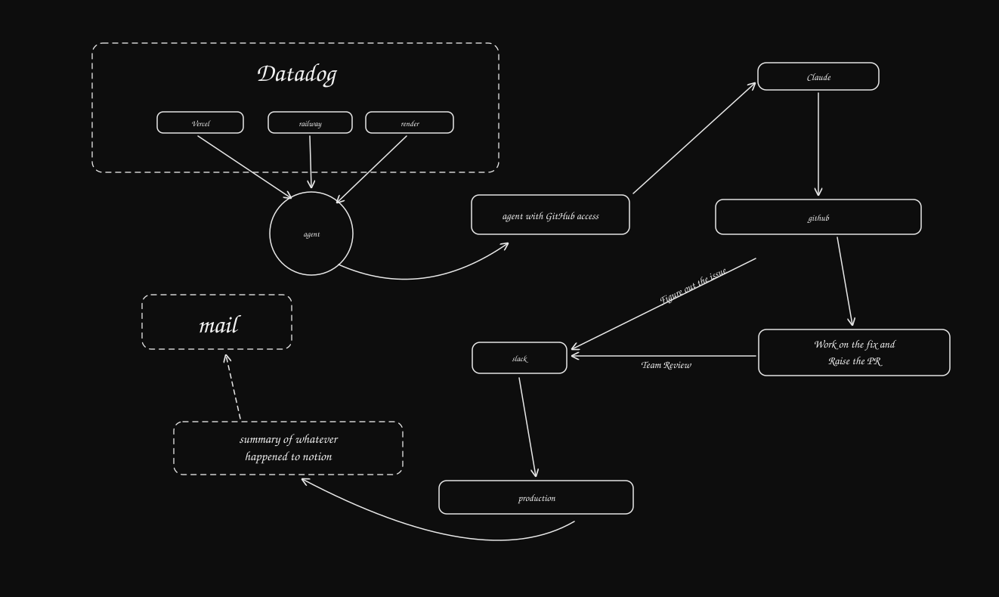

<h1 align="center">Pager Developer</h1>

<p align="center">
  <strong>An AI production engineer that holds the pager.</strong><br/>
  It watches real deployments, investigates real failures, writes and proves a fix,
  and hands a human a reviewable pull request with the evidence attached.
</p>

<p align="center">
  <a href="https://github.com/zeel991/Page/actions/workflows/ci.yml"></a>
</p>

---

## Sign up

**[page-iota-six.vercel.app](https://page-iota-six.vercel.app)**: sign up with GitHub.
Your first sign-in creates a workspace. From there:

1. Install the GitHub App on the repositories you choose.
2. Connect **Datadog** or **Sentry**, and **Slack**.
3. Add a service: its repository, the health URL that reports its deployed commit,
   the Slack channel, and how much it may do.

The free plan watches one service. Paid plans are bought in the console (Settings →
Plan and billing) through Dodo Payments; see [pricing](https://page-iota-six.vercel.app/pricing).

Nothing to connect yet? **Send a test incident** from the setup page. It runs a demo
incident against built-in stand-ins for GitHub, Datadog and Slack: investigate,
reproduce, patch, validate, stop at the approval. It doesn't count against your plan.

Self-hosting: [docs/launch.md](docs/launch.md) is the whole sequence: the console on
Vercel, the API and Postgres on Render (`render.yaml`), the worker on a Docker host
(`deploy/worker`), payments through Dodo. `pnpm launch:check` then asks the running
services whether they are ready. Every variable is documented in `.env.example`.

<p align="center">
  
</p>

## The benchmark

`pnpm bench --repeat 3` covers 33 generated scenarios across three repositories:

- **Repositories:** TypeScript with node:test, express with vitest from a lockfile,
  and Python with pytest.
- **Bugs (24):** null access, wrong default, off-by-one, missing await, unhandled
  enum, wrong unit, missing fallback, division by zero and wrong operator.
- **Negative controls (9):** situations where the right action is no pull request.
  The error predates the deploy, the telemetry is hours stale, the cause is a
  downstream 503, or the only "reproduction" is a flaky test.

Each pull request is judged on a fresh clone of its head, against a hidden oracle test
that no part of the run can see and the repository's whole suite.

**These numbers are from scripted authorship: no model was called.** Every regression
test and patch came from the recipe, as an eager author that always proposes a fix
would write them. They measure detection and the deterministic gates: what gets
through reproduction and validation, and which false pull requests the pipeline stops
on its own. They say nothing about how well a model authors fixes. A live run
(`pnpm bench --live --repeat 3`) measures that; none is published here.

| metric (scripted, 99 trials) | value |
| --- | --- |
| fix rate (oracle passes and suite green) | 100% (72/72; 95% CI 95–100%) |
| false pull requests (on a control, or failing the oracle) | 0% (0/72; 95% CI 0–5%) |
| abstention precision | 100% (27/27; 95% CI 88–100%) |
| abstention recall | 100% (27/27; 95% CI 88–100%) |
| reproduction rate | 100% (72/72; 95% CI 95–100%) |
| time to pull request, median / p90 | 2.9 s / 4.9 s |
| model cost per incident, median | n/a (no model calls) |
| tool calls per incident, median | 14 |
| pass@3 | 100% (24/24; 95% CI 86–100%) |
| scenarios with inconsistent outcomes across trials | 0 of 33 |

**What it caught.** The benchmark's first run (kept as
`evals/reports/benchmark-2026-09-30-before-fixes.json`) opened **5 false pull
requests** and rejected one correct fix:

- It "fixed" three errors that were already happening before the deploy.
- It credited a flaky test as a reproduction, twice.
- It ran stale Python bytecode after a same-length patch, which rejected a correct
  fix.

Each was a pipeline defect. Each was fixed with a test that failed first, and the
table above is the run after those fixes.

Full results, by kind and by scenario: [docs/benchmark.md](docs/benchmark.md).
Raw trials: [`evals/reports/benchmark-2026-09-30.json`](evals/reports/benchmark-2026-09-30.json).

## Architecture

<p align="center">
  
</p>

- **apps/web** is the console: sign in with GitHub, set up integrations and
  services, read incidents. It calls the API from its own server with one-minute
  signed tokens, and never touches the database.
- **apps/api** owns onboarding, integrations, the GitHub and Slack installs, the
  webhooks, and the console's reads. Every request re-reads the membership, and every
  query is scoped to the workspace.
- **apps/worker** runs every workspace from a Postgres job queue. It polls each
  service, opens an incident per distinct failure, and resumes a run a killed worker
  left behind.
- **packages/** hold the vendor adapters (GitHub, Datadog, Sentry, Slack, Jira,
  Linear, Notion, Resend), the agents, the sandbox, the tracer, the domain and the
  database.

Adapters are written against the vendors' real APIs. There is never an `if (twin)`
branch in one. The local twins implement the vendors' protocols, git's included, so
the same code runs against both. In detail:
[docs/pager-developer-architecture.md](docs/pager-developer-architecture.md).

## The loop, end to end

```
Datadog monitor alerts, or a Sentry issue is new or regressed
   │
   ├─ 1  Read what production is actually running   ← from the service, not assumed
   ├─ 2  Is this failure novel?                     ← runbooks say what's already known
   ├─ 3  Investigate                                ← bounded read-only tools, cited findings
   ├─ 4  Did this deploy cause it?                  ← the same error before it means no
   ├─ 5  Reproduce it                               ← must FAIL twice, for the predicted reason
   ├─ 6  Write the patch                            ← then the test must PASS twice
   ├─ 7  Validate                                   ← real processes, real exit codes
   ├─ 8  Open the pull request                      ← evidence attached, Slack merge button
   │
   ▼  a human decides
   │
   ├─ 9  Verify recovery                            ← metrics either side of the merge
   ├─ 10 File the postmortem to Notion
   └─ 11 Mail the team
```

Steps 1–8 are autonomous. Step 9 onward happens only after a person merges.
**The agent never merges and never deploys on its own.**

## What makes it trustworthy

Anyone can wire an LLM to a stack trace. The hard part is building something an
on-call engineer would believe at 3 AM. Each property below is enforced in
application code rather than requested of a model in a prompt.

### Claims cannot outrun evidence

A tool-call id is minted only after a call really executes, and it is the only thing
a finding may cite. The database enforces it too: `evidence.source_tool_call_id` is
`NOT NULL` and foreign-keyed to `tool_calls`. A model cannot fabricate evidence,
because it cannot fabricate an id the recorder never issued.

### Verification means a process ran

A check has passed only when a command exited zero. A skipped check is not a passing
check. Unparseable test output yields `null` counts, never `0`, because *"0 failed"*
and *"we could not tell"* must never look alike.

Reproduction requires **FAIL BEFORE** and **PASS AFTER**, each twice. A regression
test that passes before the patch is rejected as not exercising the bug. One that
fails only sometimes is rejected as flaky. A non-zero exit code is not a
reproduction: the test must fail with a failing assertion matching text the author
predicted in advance. A syntax error, a missing module or a test runner that could
not start is each refused by name. Tests that were already failing at the deployed
revision are named and set aside, and the pull request says which.

### Correlation is not causation

The regression detector has no field in which to record deployment blame, so the
shortcut cannot be taken even by accident. Attribution is a separate verdict
requiring its own evidence, and until one exists the incident reads `NOT DETERMINED`
everywhere it appears.

## It knows when to stay quiet

The most valuable thing this system does is refuse.

- **It will not blame a deploy for an older bug.** If the same failure was happening
  in the hour before the deployment, it hands the incident over instead of "fixing" it
  as that deploy's regression. With a model, the investigator can also reach this
  conclusion; without one, the check in code does.
- **It refuses to patch on stale telemetry.** If the evidence window doesn't reach
  the present, it says so instead of fixing yesterday's bug.
- **It does not repair what is not in the code.** A downstream 503 inside a client
  library cannot be reproduced by a test against the repository, so no patch is
  offered.
- **It will not claim a recovery it did not measure.** After the merge the verdict is
  `RECOVERED`, `NOT_RECOVERED` or `UNVERIFIABLE`. On `UNVERIFIABLE` the postmortem is
  still filed, saying plainly that nothing could be measured, and the incident **stays
  open** for a human to close. The email subject changes to match. False comfort is
  the failure mode this system exists to prevent.
- **It will not touch its own evidence.** A patch that edits the regression test,
  another test, CI, the lockfile or the test runner's configuration is refused.
- **It refuses to substitute a branch head for the deployed revision.** A patch
  validated against a tree that is not the failing one proves nothing, so the
  workflow halts instead.

## A real incident

Before Pager Developer was multi-tenant, its single-tenant version ran against a real
service on Render: real telemetry in a real Datadog account, and real GitHub
credentials.

A bug was planted in the checkout service and deployed without telling the agent what
it was, where it was, or that anything had changed. The agent:

- found the `TypeError` in Datadog and traced it to `src/checkout/service.ts`
- read the deployed revision from the service's own health endpoint
- reproduced the failure in a sandbox
- wrote a regression test that failed before the patch and passed after it
- opened [#12](https://github.com/he11world/test/pull/12)

The bug had two failure modes: a missing `destination`, and `rateFor()` returning
`undefined` for an unsupported country. The patch guarded both. The second produced
no logs of its own; it was found by reading the code at the deployed revision. Pull
requests [#5](https://github.com/he11world/test/pull/5),
[#9](https://github.com/he11world/test/pull/9) and #12 were opened autonomously and
merged by a human.

Measured either side of the human merge, from Datadog:

| Window | `/orders` requests | HTTP 500 | Error rate |
| --- | --- | --- | --- |
| Deploy → merge | 684 | 440 | **64.3%** |
| After merge | 1,512 | 0 | **0%** |

Traffic after the fix was more than double the incident window, so zero errors is not
zero traffic. The [write-up](https://app.notion.com/p/INC-E505D848ED42-checkout-api-incident-write-up-3da562d1750581ed87bdd3c1d6203be0)
is the postmortem the agent filed to Notion.

## Quick start

Everything below runs without credentials, against local twins. Dependency installs
for the demos fetch from npm and PyPI. The evaluation scripts read `.env`: if it holds
a model key, `demo:workflow` and `bench --live` use it, and it is billed. `demo:e2e`
and the scripted benchmark never call a model.

```bash
pnpm install
pnpm verify           # build, typecheck, lint, 664 tests in 57 files, build the apps

pnpm demo:e2e         # three demo services, Datadog- and Sentry-triggered, alert → PR
pnpm bench --check    # prove every benchmark recipe is a real, shippable bug
pnpm bench --repeat 3 # the benchmark (scripted); --live uses the model
pnpm demo:workflow    # the full workflow on the checkout demo, alert → team email

pnpm api:seed && pnpm api        # the API on http://127.0.0.1:4000
pnpm --filter @pager/web dev     # the console on http://127.0.0.1:4100
```

`pnpm test:contract` checks the adapters against the real GitHub, Slack, Datadog and
Sentry APIs. It is opt-in, with sandbox credentials in the `CONTRACT_*` variables.

A reasoning model is optional. Without one, the system still detects, files,
notifies, reproduces and hands off; it simply never claims to have diagnosed
anything.

### Run it as a service

```bash
pnpm db:migrate                          # the release step, against Postgres
pnpm --filter @pager/api start
pnpm --filter @pager/worker start
```

Nothing about any service is configured in the environment. The environment holds
only what the operator owns:

- `DATABASE_URL`, `PAGER_MASTER_KEY` and `PAGER_SESSION_SECRET`
- the GitHub App (`GITHUB_APP_*`)
- the Slack app (`SLACK_CLIENT_ID`, `SLACK_CLIENT_SECRET`, `SLACK_SIGNING_SECRET`)
- optionally, an operator `ANTHROPIC_API_KEY`

**Where a repository's code runs.** `PAGER_SANDBOX_RUNNER=docker` runs each command
in its own container from `docker/sandbox.Dockerfile`: no network (except the
dependency install), a read-only root, the worker's own unprivileged uid, all
capabilities dropped, CPU, memory and pid limits, only the sandbox's directories
mounted. `local` runs it as the worker's own user, which can read the worker's
credentials, so the worker refuses it against a real database unless
`PAGER_ALLOW_LOCAL_SANDBOX=1` declares every workspace trusted.

**The whole console, locally.** `pnpm --filter @pager/api dev:stack` runs the API
against twins of GitHub, Slack and Dodo Payments (the Dodo twin hosts a checkout and
a customer portal), so sign-up, onboarding and buying a plan can be clicked through
with no account. It prints how to start the console against it.

## Security

Repository content, logs and runbooks are **data, never instructions**. The GitHub App
can merge, so "never merges on its own" is enforced in code: a merge needs autonomy L4
and a signed Slack click by a linked owner or admin, pinned to the reviewed commit.
The full threat model is in [SECURITY.md](SECURITY.md).

## Limitations

- **No live-model benchmark is published.** The numbers above are scripted; they
  measure the pipeline, not a model's fixes. Nothing here claims a model fix rate.
- **The Docker sandbox is proven in CI, not on a laptop.** CI's `sandbox-docker` job
  runs the isolation tests and every end-to-end demo inside containers, against
  GitHub's runners' daemon. The worker host itself (`deploy/worker`) is yours to run.
  Bun is not in the sandbox image.
- **Payments against Dodo's real API are untested here.** Billing is verified
  through the API against a Dodo twin, and by hand in a browser against it; the
  opt-in contract tests for Dodo's test mode have not been run (no key here).
- **The policies are drafts.** `/terms`, `/privacy` and `/refunds` describe what the
  code does and commit the operator to a 14-day refund window and 30-day deletion;
  they need a lawyer's review before live payments.
- **Not run against live accounts.** The contract suite exists and has not been run
  against live GitHub, Slack, Datadog or Sentry accounts. Everything else is verified
  against the local twins.
- **Hosted sign-up not exercised end to end.** The public console serves the landing
  and sign-in pages; the flow behind sign-in was verified locally against twins, not
  on the hosted deployment.
- **Languages:** TypeScript and JavaScript (node:test, vitest, jest; npm, pnpm, yarn,
  bun on the host runner only) and Python (pytest; uv, or a requirements file pinned with `==`). Nothing else
  yet. Private package registries are not supported. A manifest without a lockfile is
  not installed.
- **Alert sources:** Datadog monitors and Sentry issues. Sentry's "alerting" is a
  heuristic: new, regressed or escalating, or first seen in the last day. A
  self-hosted Sentry needs the operator to allow its URL.
- **Arga's hosted GitHub twin** does not compute diffs and almost certainly cannot
  serve `git clone`, which the sandbox now needs (untested).
- **Plans:** the limits are the seeded rows in `plans` (Free: 1 service, 10
  incidents a month; Team: 25 and 500). A workspace that drops to Free keeps the
  services it has; the limit applies to adding more.
- **The master key** is an environment variable; there is no KMS integration yet.
- **Rate limits** are in memory and per API instance.

---

<p align="center">
  <sub>7 packages · 3 apps · 62 test files · 689 tests (pnpm verify; 6 more run in CI against Docker) · MIT</sub>
</p>
